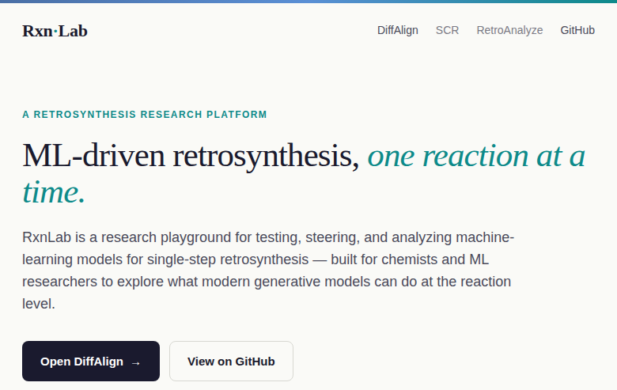
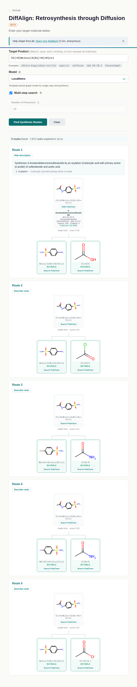
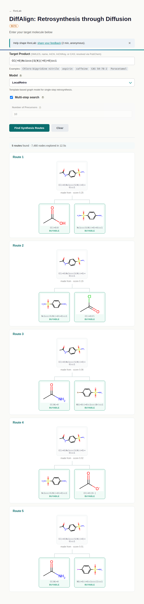
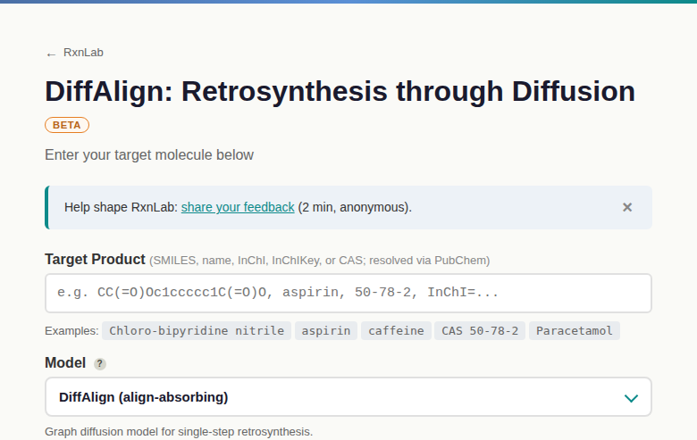

<div align="center">

# Rxn·Lab

**An open-source platform to run, steer, and evaluate machine-learning models for retrosynthesis** —
from single-step disconnections to full multi-step routes.

[](https://rxnlab.org)
[](LICENSE)
[](https://www.python.org/)
[](https://github.com/microsoft/syntheseus)
[](https://github.com/NajwaLaabid/RxnLab/stargazers)

### 👉 **Try it now at [rxnlab.org](https://rxnlab.org)** — no install, no login.



</div>

---

RxnLab puts several state-of-the-art retrosynthesis models behind one interface so you can
ask the same question — *how would I make this molecule?* — of each of them, and compare the
answers. It is built for **chemists** who want quick, model-backed disconnection ideas and for
**ML researchers** who want a shared yardstick for reaction-level generative models.

## What it does

| | |
|---|---|
| **Single-step prediction** (`/lab`) | Pick a model, enter a target (SMILES, name, InChI, InChIKey, or CAS — resolved via PubChem), get ranked precursor sets with reaction-class labels (via RXN-Insight) and PubChem compound lookups. |
| **Multi-step search** (`/multistep`) | Retro\*-based route planning over a registered model and a building-block catalog, rendered as route trees with per-step descriptions. |
| **Model comparison** (`/compare`) | Run several models on one target and see where they agree: a consensus table ranked by agreement, per-model disconnection profiles, and filters. |
| **Steering / inpainting** (`/diffalign`) | DiffAlign-specific: fix part of a precursor set and regenerate the rest. |

<div align="center">


</div>

## Models

All models are served through the [syntheseus](https://github.com/microsoft/syntheseus)
`BackwardReactionModel` interface, on USPTO-50k checkpoints:

| Model | Family | Backend | Paper |
|---|---|---|---|
| **DiffAlign** | graph diffusion | Modal T4 GPU | [OpenReview](https://openreview.net/forum?id=onIro14tHv) |
| **LocalRetro** | template-based | in-process | [JACS Au](https://pubs.acs.org/doi/10.1021/jacsau.1c00246) |
| **R-SMILES (RootAligned)** | seq2seq transformer | in-process | [arXiv:2203.11444](https://arxiv.org/abs/2203.11444) |
| **MEGAN** | graph-edit (semi-template) | in-process | [arXiv:2006.15426](https://arxiv.org/abs/2006.15426) |
| **MHNreact** | template retrieval (Modern Hopfield) | in-process | [arXiv:2104.03279](https://arxiv.org/abs/2104.03279) |

Each model is one entry in the registry (`app/registry.py`) carrying display metadata,
capability flags (inpainting / steering), a `backend` (`in-process` / `modal`), and a lazy
factory. Adding a model is a registry entry plus a syntheseus wrapper — see
[**Adding a model**](#adding-a-model).

<div align="center">

</div>

## Repository layout

```
app/                Flask application
  registry.py         model registry — single source of truth for available models
  routes/             blueprints: landing, predict, search, compare, feedback, stats, health
  backends/           remote backends (Modal proxy for DiffAlign)
  rendering/          SVG drawing, reaction classification, PubChem lookup
  templates/, static/ UI
evaluation/         PubChem resolution + scoring helpers
scripts/            dev launcher + inventory builders + Modal smoke/parity checks
rahti/              legacy OpenShift/Rahti deploy manifests
DiffAlign/          DiffAlign model (git submodule)
Dockerfile, Procfile, docker-compose.yml   container + process definition
requirements.txt, requirements-modal.txt   app deps / Modal GPU service deps
wsgi.py             WSGI entry point (gunicorn loads `application`)
```

## Local development

Python 3.10 in a conda env named `diffalign-10` (the project pins 3.10). The DiffAlign
submodule must be checked out:

```bash
git clone --recurse-submodules https://github.com/NajwaLaabid/RxnLab.git
cd RxnLab
conda create -n diffalign-10 python=3.10 && conda activate diffalign-10
pip install -r requirements.txt
pip install -e ./DiffAlign
```

Then launch the dev server:

```bash
./scripts/run-local.sh      # activates the env, sets dev vars, runs `python wsgi.py`
```

This serves on `http://localhost:8080`. The app runs **without a database** (feedback and
analytics simply aren't persisted) unless `DATABASE_URL` is set — `docker compose up -d`
gives you a local Postgres if you want one. With no `RXNLAB_MODAL_*` vars set, DiffAlign runs
in-process (slow); set them to use the Modal GPU service instead. syntheseus checkpoints
(LocalRetro / R-SMILES / MEGAN / MHNreact) auto-download from Figshare on first use.

## Deployment

Containerized via `Dockerfile` (gunicorn, per `Procfile`), deployed on a CPU-only host
(Hetzner + Coolify); DiffAlign runs on a Modal GPU and is reached through a proxy backend.
Postgres backs the chemist-feedback store and the PubChem cache.

### Key environment variables

| Variable | Purpose |
|---|---|
| `DATABASE_URL` | Postgres DSN; unset ⇒ run without persistence |
| `RXNLAB_MODAL_DIFFALIGN_URL`, `RXNLAB_PROXY_TOKEN` | route DiffAlign to the Modal GPU service |
| `RXNLAB_INVENTORY_PATH` / `RXNLAB_ENAMINE_PATH` / `RXNLAB_TESTCATALOG_PATH` | building-block catalogs for multi-step search |
| `SYNTHESEUS_CACHE_DIR` | where syntheseus checkpoints are cached |
| `GIT_PYTHON_REFRESH=quiet` | required so MEGAN imports without a git binary present |

## Adding a model

RxnLab is designed so that a new model is a small, self-contained contribution — the syntheseus
wrapper *is* the contribution unit.

1. Write a syntheseus `ExternalBackwardReactionModel` wrapper (or reuse one syntheseus ships).
2. Add a `ModelSpec` to `_SPECS` in `app/registry.py`: id, display name, capability flags,
   `backend`, a lazy `wrapper_factory`, optional per-model param schema, and `metadata`
   (including a `paper` URL — it surfaces on the landing page automatically).
3. For multi-step, add an optional lean `search_factory` and register the id in
   `app/search.py`.

Open an issue if you'd like a model added and don't want to wire it up yourself.

## Notes

- **Predictions are model suggestions, not verified routes.** Always sanity-check before
  taking anything into a lab.
- The DiffAlign building-block catalog is derived from eMolecules data: it may be *used* but
  **not redistributed** — it is never committed to this repo or baked into the public image,
  and is loaded from a private path at runtime.

## Acknowledgements

Model inference and multi-step search are built on
[syntheseus](https://github.com/microsoft/syntheseus). Each bundled model is the work of its
original authors — see the papers linked in the [Models](#models) table.

## License

Released under the [MIT License](LICENSE). Bundled models carry their own upstream licenses
(see the per-model papers/repos linked above), and the eMolecules-derived building-block
catalog is not redistributable (see *Notes*).

---

<div align="center">
Built by <a href="https://github.com/NajwaLaabid">Najwa Laabid</a>, doctoral researcher at Aalto University.<br>
If RxnLab is useful to you, a ⭐ helps others find it.
</div>
